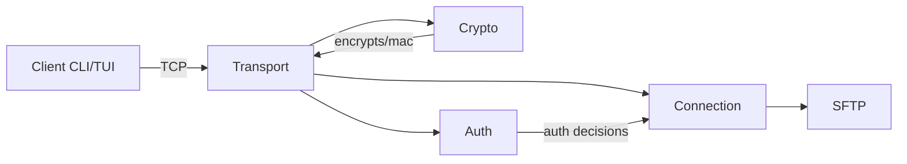

<!-- prettier-ignore -->
# SwiftSSH


> SwiftSSH is an educational SSH-2 implementation in Rust — a compact, readable reference
> that demonstrates transport, authentication, channel multiplexing, and an SFTP subsystem.
>
> ⚠️ Not for production use. Audit crypto/host-key handling before exposing to untrusted networks.

---

## Table of contents

1. [Quick demo](#quick-demo)
2. [Architecture](#architecture)
3. [Features](#features)
4. [Getting started](#getting-started)
5. [SFTP examples](#sftp-examples)
6. [Testing & CI](#testing--ci)
7. [Development notes](#development-notes)
8. [Contributing](#contributing)
9. [License](#license)

---

## Quick demo

Start the server (defaults to `0.0.0.0:2222`):

```bash
cargo run --bin swiftssh-server --release
```

Execute a command on the server:

```bash
cargo run --bin swiftssh-client -- --user admin --password admin --command "whoami"
```

Start an interactive shell session:

```bash
cargo run --bin swiftssh-client -- --user admin --password admin --interactive
```

---

## Architecture

A high-level view of the main components:



Key folders:

- `src/packet` — packet codec & wire helpers
- `src/transport` — version exchange, key exchange, packet I/O
- `src/crypto` — AES-CTR, HMAC, key derivation helpers
- `src/auth` — auth parsing + server `UserDatabase`
- `src/connection` — channel management and builders/parsers
- `src/sftp` — SFTP v3 subset and server handler

---

## Features

- ✅ Async-first design using Tokio
- ✅ X25519 (Curve25519) ephemeral key exchange
- ✅ AES-256-CTR encryption + HMAC-SHA256 integrity
- ✅ Password and public-key authentication (server-side `UserDatabase`)
- ✅ Multiplexed channels: `exec`, `shell`, `pty-req`, `subsystem` (SFTP)
- ✅ SFTP subset: open / read / write / readdir / stat / mkdir / rmdir / remove
- ✅ Unit tests for protocol and crypto primitives

---

## Getting started

Prerequisites

- Rust (stable) and `cargo`

Build

```bash
cargo build --release
```

Run server

```bash
# default: listen on 0.0.0.0:2222 and create SFTP root
cargo run --bin swiftssh-server --release
```

Run client

```bash
cargo run --bin swiftssh-client -- --user admin --password admin --command "ls -la"
```

Notes

- Default SFTP root: `/tmp/swiftssh` (server will create it if missing)
- Default example users: `admin`/`admin`, `user`/`password`

---

## SFTP examples

SFTP runs as a `subsystem` over a channel. That channel carries length-prefixed SFTP packets.

Example: list a directory using the system `sftp` client after negotiating the subsystem.

```text
# (after successful session & subsystem negotiation)
# Use the built-in SFTP; paths are rooted at server SFTP root.
sftp> ls
sftp> get README.md
```

The SwiftSSH SFTP handler enforces path normalization and prevents traversal outside the configured root.

---

## Testing & CI

Run tests locally:

```bash
cargo test
```

Suggested CI checks for PRs:

- `cargo test`
- `cargo fmt -- --check`
- `cargo clippy -- -D warnings`

---

## Development notes

- Format: `cargo fmt`
- Lint: `cargo clippy`
- Tests: `cargo test`

Design tips

- Keep cryptographic code confined to `src/crypto` to simplify audits and replacements.
- Add unit tests for packet round-trips when changing wire formats.

---

## Contributing

1. Open an issue describing your change.
2. Branch, implement tests, and open a PR.

Please avoid changing crypto defaults without discussion.

---

## License

MIT
